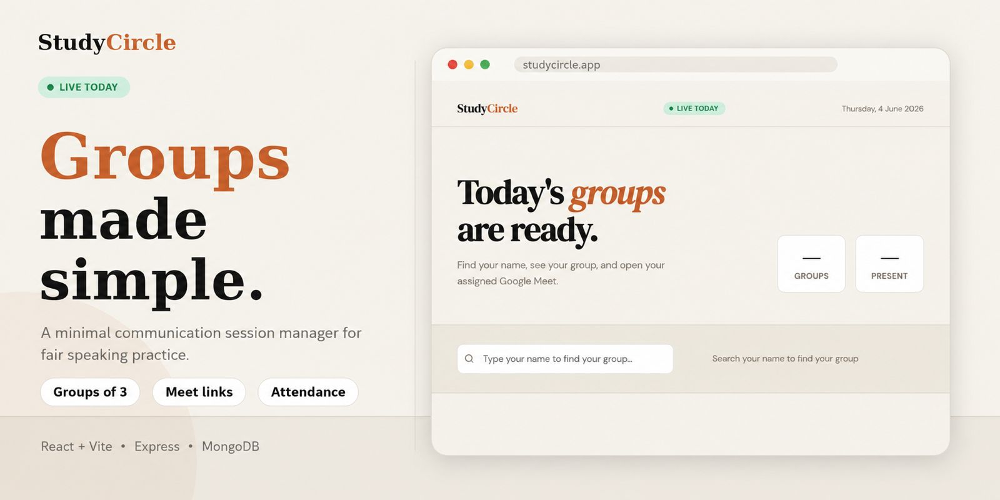

# StudyCircle – Communication Session Group Manager

StudyCircle is a small full-stack tool I built to organize our daily communication sessions and give every student a fair opportunity to speak and coordinate a group.

I created this project while studying at Brototype. Our communication sessions usually last one hour and may include around 15–16 students. When everyone participates in a single group, each person gets only a few minutes to speak, and even that is not always guaranteed.

StudyCircle solves this by automatically dividing the students who are present into smaller groups. It also selects a coordinator for each group and assigns an available Google Meet link automatically.

The person managing the session only needs to add the students and mark their attendance. The application handles the remaining work.

---

## Why I Built It

In a one-hour session with 15 students, each person would get only around four minutes if the time were divided equally.

In practice, introductions, transitions, and longer conversations reduce that time even further.

Dividing students into smaller groups gives everyone more time to speak, but managing those groups manually creates additional work:

* Checking who is present
* Dividing students into balanced groups
* Selecting coordinators fairly
* Making sure the same person is not repeatedly selected
* Assigning a Google Meet link to every group
* Sharing the final group details with students

StudyCircle automates this process.

---

## How It Works

### Session Manager

1. Add the students to the application
2. Mark the students who are present
3. Generate the session groups
4. Publish the generated groups

Once the present students are marked, the application automatically:

* Divides them into small groups
* Selects a coordinator for each group
* Assigns an available Google Meet link
* Prepares the final group details for publishing

The session manager does not need to manually create groups, select coordinators, or assign meeting links.

### Students

1. Open the application
2. Find their assigned group
3. View the group members and coordinator
4. Open the assigned Google Meet link
5. Join the communication session

Students do not need to create an account or log in.

---

## Automatic Coordinator Rotation

StudyCircle selects coordinators fairly.

A student who has already coordinated a previous group is not selected again while other eligible students are still waiting for their first opportunity.

The application prioritizes students who have coordinated fewer sessions. After everyone has received a chance, the coordinator cycle can begin again.

This prevents the same students from repeatedly becoming coordinators and gives everyone an equal opportunity to take responsibility.

---

## Automatic Google Meet Assignment

The application automatically assigns an available Google Meet link to every generated group.

The session manager does not need to copy and assign links manually. When the groups are generated, each group receives its meeting link as part of the same process.

Students can open the published group details and join their assigned meeting directly.

---

## Main Features

* Student management
* Attendance marking
* Attendance-based group generation
* Automatic division into small groups
* Automatic coordinator selection
* Fair coordinator rotation
* Automatic Google Meet link assignment
* Published group details
* No-login experience for students
* Separate frontend and backend applications

---

## Tech Stack

| Layer    | Technology             |
| -------- | ---------------------- |
| Frontend | React with Vite        |
| Backend  | Node.js and Express.js |
| Database | MongoDB                |

---

## Project Structure

```text
StudyCircle/
├── Frontend/    # React and Vite frontend
├── Backend/     # Node.js and Express.js API
└── README.md
```

---

## Installation

### 1. Clone the repository

```bash
git clone https://github.com/arjunpj-11/StudyCircle
cd StudyCircle
```

### 2. Set Up the Backend

```bash
cd Backend
npm install
```

Create a `.env` file inside the `Backend` directory:

```env
MONGO_URI=your_mongodb_connection_string
PORT=5000
```

Start the backend:

```bash
npm run dev
```

### 3. Set Up the Frontend

Open another terminal:

```bash
cd Frontend
npm install
npm run dev
```

---

## What I Learned

StudyCircle is a small project built to solve a real problem in our daily communication sessions.

Through this project, I worked with:

* React frontend development
* Node.js and Express.js API development
* MongoDB data management
* Frontend and backend integration
* Attendance-based filtering
* Random group-generation logic
* Fair coordinator-rotation logic
* Automatic resource assignment
* Designing a simple no-login user experience

The goal was not to build a large platform. It was to reduce the manual work involved in organizing communication sessions and give every student more time and an equal opportunity to participate.

---

## Possible Improvements

* Admin authentication
* Session history
* Previous-group tracking
* Improved group-balancing logic
* Real-time group updates
* Notifications when groups are published
* Exporting session details
* More flexible group-size settings

---

## Contributing

This project was created for a specific communication-session workflow, but suggestions and improvements are welcome.

You can fork the repository, make changes, and open a pull request.

---

## License

This project is available under the [MIT License](LICENSE).

---

> Built to automate communication-session groups and give every student more time and a fair chance to coordinate.
